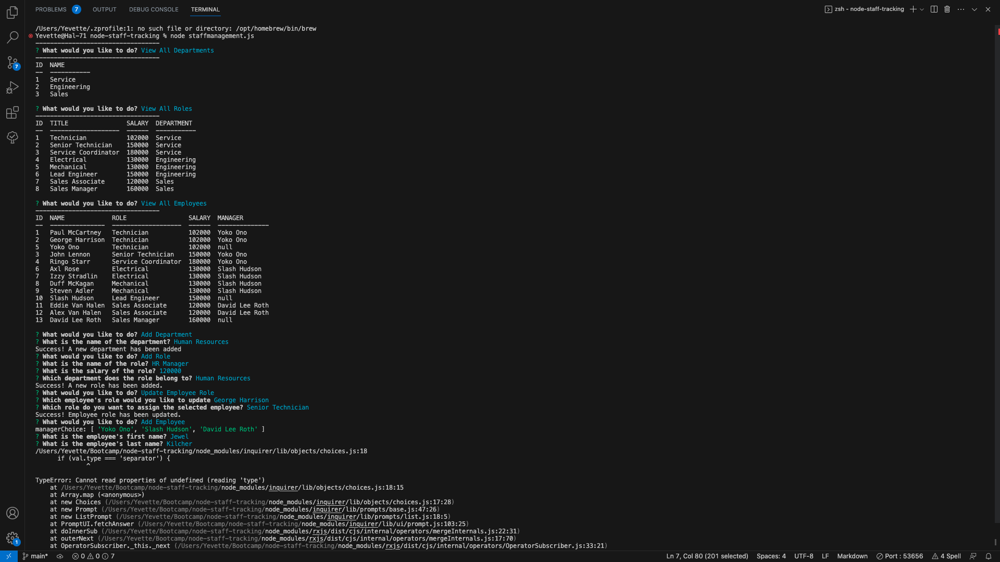

# Node Staff Tracking

## Description

This command line interface application allows the user to efficiently perform view and interact with stored information in the employee database without the need for a graphical user interface. 

With this employee management application, business owners can efficiently organize and plan their business by viewing and managing departments, roles and employees in a streamlined and user-friendly manner.

## Features:

 - View Departments
 - View Roles
 - View Employees
 - Add Departments
 - Add Roles
 - Add Employees
 - Update Employee Roles

## Installation:

To initialize this application, install Node.js and navigate to the project directory in your terminal. In your command prompt run the command node staffmanagement.js. You will be presented with a menu of options. Choose your desired option by selecting from the provided choices. Follow the prompts and enter the requested information for each operation. The application performs the requested operation and provides feedback with confirmation messages. Select Quit to navigate out of the application.

## Credits: 
Stack Overflow
freecodecamp.org - https://www.freecodecamp.org/news/how-to-build-a-command-line-application-with-nodejs/

## License:

## Contact:

If you would like additional information, please contact Yevette Hunt.
My GitHub username is yveivy

## Demo Video: 

https://drive.google.com/file/d/1do47vtVPskAGAxE7VdCufUaK_Qa8l97o/view